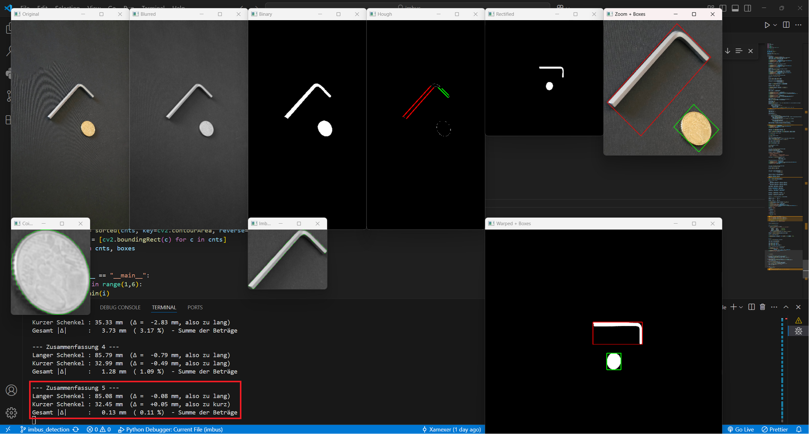

# Inbus size detection

## Process
* Loads the image, scales it to a width of 1500 px
* Grayscale + Gaussian blur (blur_image)
* Binary threshold + erosion/dilation (apply_threshold)
* Find contours (get_contours_and_boxes), crop Allen key and coin boxes
* Canny edges + HoughLinesP: detect lines
* Sort lines by angle into “long” vs. “short”, calculate average angles
* Build homography from axis directions → warpPerspective (rectification)
* In the rectified image, retrieve contours & boxes again → pixel measurements for Allen key + coin
* Convert to mm using coin reference (24.25 mm)
* Compare target vs. actual dimensions → calculate differences in mm and %
* Output results (lengths, deviations) in the console

## Result
avg ~1.11% difference

